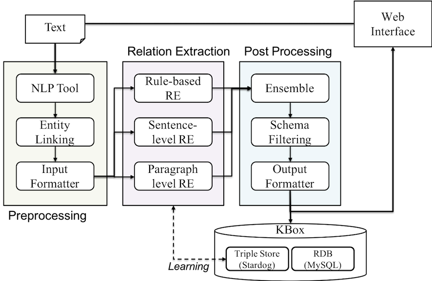

# WiseKB Demo System

## About
Korean Knowledge Extraction System Demo

## Libraries
* `Java 1.8`
* `Maven`
* `Javascript`
* `Python 3`

## Architecture

## Component Modules
* [Entity Linking](https://creativecommons.org/licenses/by-nc-sa/2.0/)
* [Rule-based RE](https://creativecommons.org/licenses/by-nc-sa/2.0/)
* [Sentence-level RE: CNN](https://creativecommons.org/licenses/by-nc-sa/2.0/)
* [Sentence-level RE: LSTM](https://creativecommons.org/licenses/by-nc-sa/2.0/)
* [Paragraph-level RE](https://creativecommons.org/licenses/by-nc-sa/2.0/)

## Licenses
* `CC BY-NC-SA` [Attribution-NonCommercial-ShareAlike](https://creativecommons.org/licenses/by-nc-sa/2.0/)
* If you want to commercialize this resource, [please contact to us](http://mrlab.kaist.ac.kr/contact)

## Publisher
[Machine Reading Lab](http://mrlab.kaist.ac.kr/) @ KAIST

## Acknowledgement
This work was supported by Institute for Information & communications Technology Promotion(IITP) grant funded by the Korea government(MSIT) (2013-0-00109, WiseKB: Big data based self-evolving knowledge base and reasoning platform)
